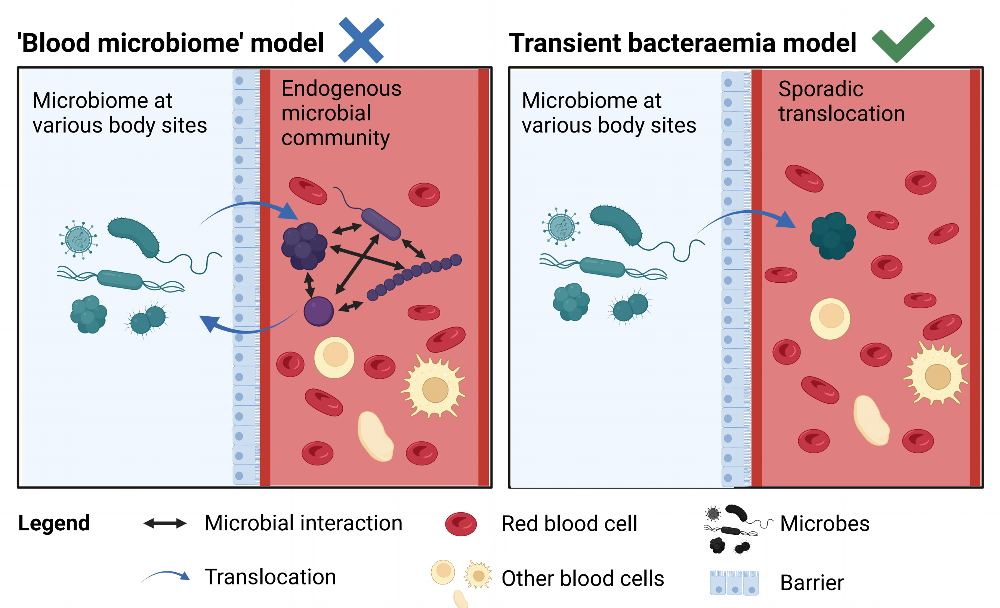

# No evidence for a common blood microbiome based on a population study of 9,706 healthy humans
### Cedric C.S. Tan[1,2], Karrie K.K. Ko[1,3,4,5], Hui Chen[1], Jianjun Liu[1], Marie Loh[6,7,8], SG10K_Health Consortium, Minghao Chia[1#], Niranjan Nagarajan[1,5#]
1)	Genome Institute of Singapore (GIS), Agency for Science, Technology and Research (A*STAR), 60 Biopolis St, Singapore 138672, Republic of Singapore.
2)	UCL Genetics Institute, University College London, Gower St, London WC1E 6BT, United Kingdom.
3)	Department of Microbiology, Singapore General Hospital, Outram Road, Singapore 169608, Republic of Singapore.
4)	Department of Molecular Pathology, Singapore General Hospital, Outram Road, Singapore 169608, Republic of Singapore.
5)	Yong Loo Lin School of Medicine, National University of Singapore, 10 Medical Dr, Singapore 117597, Republic of Singapore.
6)	Population and Global Health, Lee Kong Chian School of Medicine, Nanyang Technological University, 11 Mandalay Road, Singapore 308232, Republic of Singapore.
7)	Department of Epidemiology and Biostatistics, Imperial College London, Exhibition Rd, South Kensington, London SW7 2BX, United Kingdom.
8)	National Skin Centre, 1 Mandalay Rd, Singapore 308205, Republic of Singapore.
#These authors jointly supervised this work

Correspondence: cedriccstan@gmail.com (C.C.S. Tan) or nagarajann@gis.a-star.edu.sg (N. Nagarajan)

Link to preprint on BioRXiv: https://doi.org/10.1101/2022.07.29.502098
Link to source data on Zenodo: https://doi.org/10.5281/zenodo.7665281

